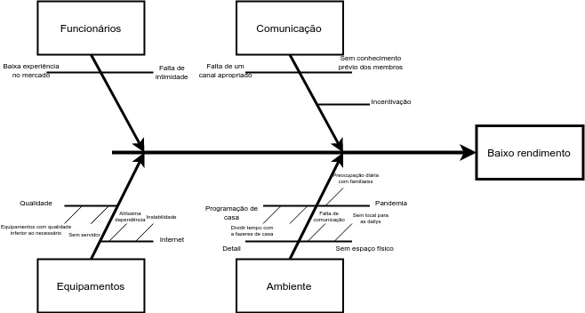

# Causa Efeito

#### Histórico de Versões

| Data | Versão | Descrição | Autor |
|------|--------|-----------|-------|
| 14/02/2021 | 1.0 | Criação do documento | Matheus Filipe |
| 18/02/2021 | 1.1 | Adição do diagrama | Victor Peixoto |

##  1. Introdução

Para analisar as potenciais variações e suas causas nós utilizamos o diagrama de Ishikawa ou diagrama de espinha de peixe. Esse mesmo diagrama pode ser utilizado para tentar mitigar e ou resolver potenciais problemas, foram feitos alguns diagramas de pontos de vista diferentes dos membros da equipe com a finalidade de encontrar e resolver problemas que culminar no atraso na entrega da demanda ou na baixa produtividade do grupo.

## 2. Diagramas

#### Referências

* SERRANO, M. Arquitetura e desenho de software - 02d - VídeoAula - DSW - Base - Causa-Efeito. Disponível em: https://aprender3.unb.br/course/view.php?id=6245.  
