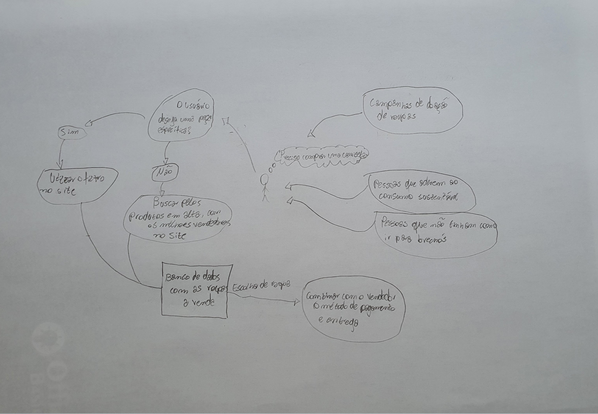

# Rich Picture

#### Histórico de Versões

| Data       | Versão | Descrição              | Autor          |
| ---------- | ------ | ---------------------- | -------------- |
| 14/02/2021 | 1.0    | Criação do documento   | Matheus Filipe |
| 16/02/2021 | 1.1    | Adição de conceitos    | Matheus Filipe |
| 16/02/2021 | 1.2    | Adição de imagem       | Matheus Filipe |
| 16/02/2021 | 1.3    | Adição do 2° RP        | Lucas Lopes    |
| 19/02/2021 | 1.4    | Adição do 3° RP        | Murilo Schiler |
| 05/03/2021 | 1.5    | Melhorando referências | Matheus Filipe |

## 1. Introdução

### 1.1. Definição

Uma das técnicas de pré-rastreabilidade da elecitação de requisitos e que será apresentada nesse tópico é denominada Rich Picture. O Rich picture é uma técnica que procura facilitar a visualização de cenários operacionais que possui uma grande quantidade de detalhes ou regras de negócio, tem um caráter um pouco informal e é realizado em uma fase de pré-análise de projeto e ajuda a identificar as partes do fluxo de operação que são processuais ou estruturais.

### 1.2. Apresentação

#### v1.0

#### v1.0

  
 

 Autor: Matheus Filipe 

#### v1.0

 Autor: Lucas Lopes 

#### v1.0

 Autor: Murilo Schiler 

#### Referências

- SERRANO, M. Arquitetura e desenho de software - 02c - VídeoAula - DSW - Base - RichPicture. Disponível em: https://aprender3.unb.br/course/.

- RICH PICTURES. SYSTEMS.OPEN. Disponível em: http://systems.open.ac.uk/materials/T552/pages/rich/richAppendix.html.
