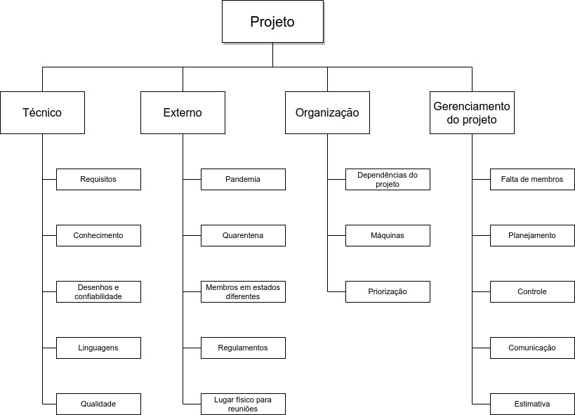

# Riscos

## 1. Introdução

O planejamento de riscos de um projeto é de suma importância para que, no momento em que se deparar com uma adversidade a equipe ter ciência de quanto tempo aquela adversidade deve demorar, como agir para mitigar seus impáctos, e como sobresair dessa adversidade. Além de tentar prever as possíveis adversidades e, com o mesmo ímpeto, prever as oportunidades que serão encontradas.

## 2. Descrição

## 2.1 SWOT
Será utilizado o método SWOT Strenghts(pontos fortes), Weaknesses(Pontos fracos), Opportunities(Oportunidades), e Threats(Ameaças), esse método nos permite verificar por meio de introspecção quais seriam os eventuais problemas e as eventuais oportunidades da produção de software a tabela SWOT do nosso projeto se configurou da seguinte forma:

<table>
  <tr>
    <td>
      
<h3>FORÇAS</h3>

      

      Membros do grupo com experiência de mercado
      

      Alta disponibilidade dos membros
    </td>
    <td>
      
<h3>OPORTUNIDADES</h3>

      

      Boa demanda pelo software
      

      Mercado pouco explorado
   </td>
  </tr>
  <tr>
    <td>
      
<h3>FRAQUEZAS</h3>

      

      Falta de conhecimento prévio sobre os integrantes
      

      Integração da equipe
      

      Experiência dos membros somente em backend ou frontend
      

      Comunicação
    </td>
    <td>
    
<h3>AMEAÇAS</h3>

    

    Prazo mais curto
    

    Desistência de membros
    

    Erros de planejamento
    

    </td>
  </tr>
</table>

##  2.2 Estrutura Analítica de Riscos (EAR)

O risco é algo extremamente complexo nos projetos e difícil de se quantificar e demanda diversas fontes para tentar o quantificar. Dessa forma utilizaremos o EAR (Estrutura Analítica de Riscos) ou RBS (Risk Breakdown Structure) essa estrutura é orientada à origem do risco em que cada nível descendente representa uma definição mais detalhada dos fatores de riscos para o projeto

