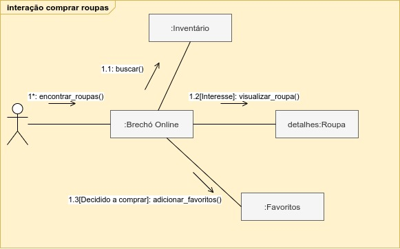

# Diagrama de Comunicação

## Versionamento

| Data | Versão | Descrição | Autor |
|------|--------|-----------|-------|
| 01/03/2021 | 1.0 | Criação do documento | Lucas Lopes |
| 02/03/2021 | 1.1 | Adição da Introduçaõ | VIctor Levi |

## Introdução

O diagrama de comunicação é derivado do diagrama de colaboração, este estando na versão v1.x do UML podendo ser tanto um diagrama comportamental como um diagrama estrutural pois avalia e relata as possíveis decisões do usuário como relata a forma a qual o sistema irá operar demonstrando classes e funções de dentro do mesmo.

## Documentos

### Interação comprar roupas

* v1.0

## Referências

* 
 https://www.uml-diagrams.org/collaboration-diagrams/collaboration.html. Acesso em: 02 mar. 2021

* 
 https://www.uml-diagrams.org/communication-diagrams.html. Acesso em: 02 mar. 2021

* SERRANO, M. Arquitetura e desenho de software - 02d - VídeoAula - DSW - Base - Causa-Efeito. Disponível em: https://aprender3.unb.br/course/view.php?id=6245.  
