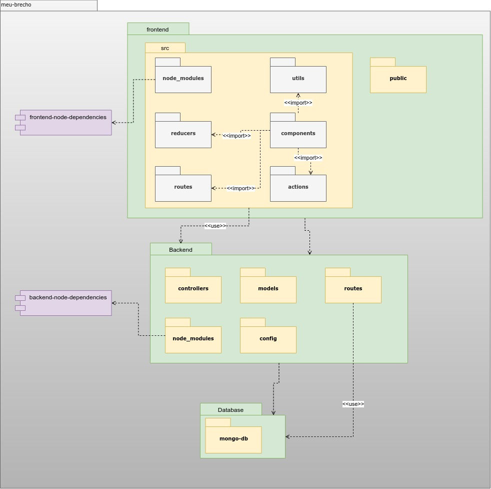

# Diagrama de Pacotes

## Versionamento

| Data | Versão | Descrição | Autor |
|------|--------|-----------|-------|
| 01/03/2021 | 1.0 | Criação do documento | Lucas Lopes |
| 02/03/2021 | 1.1 | Adição da Introdução | Victor Levi |
| 02/03/2021 | 1.2 | Adição dos documentos | Victor Levi |

## Introdução

O diagrama de pacotes ou diagrama de modelo é um diagrama estático e estrutural que permite ter uma visão com baixa abstração do projeto, sendo possível já observar o modelo de pastas do projeto, assim como suas dependências. O mesmo, a medida em que o projeto é desenvolvido, pode ser modificado.

## Documentos

### Documento geral

* V1.0

## Referências

 https://www.uml-diagrams.org/package-diagrams-overview.html. Acesso em: 02 mar. 2021

